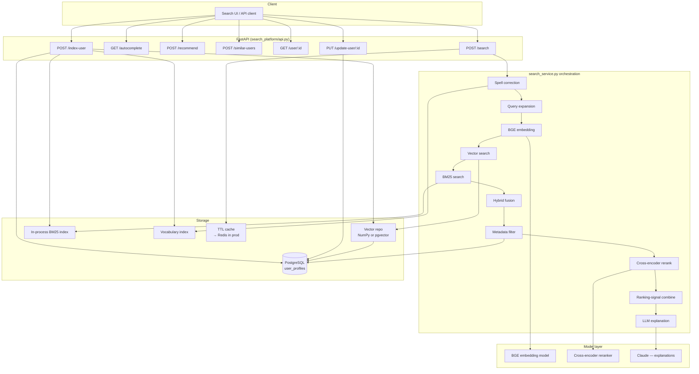
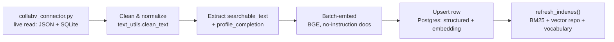

# CollabV Semantic User Search & Recommendation Platform — Architecture

This is a **backend-only AI service** — schema, ingestion pipeline, hybrid
RAG search, reranking, LLM explanations, and 9 REST APIs — meant to be
deployed behind CollabV's own existing website and called from CollabV's
own frontend. It deliberately has no UI of its own (see
[§10](#10-integrating-with-collabvs-ui) for what that means for
integration). Docker/K8s, Redis/Celery, and auth are **not built yet**;
see [What's deferred](#whats-deferred).

## 0. Data source: live CollabV, no mock data

There is no separately-hosted CollabV deployment — `app.collabv.ai`
(referenced in CollabV's own README) does not resolve to anything.
**CollabV's own backend + database, in this same repo, is the real
system.** `search_platform/collabv_connector.py` reads directly from it,
live, at sync time — `COLLABV_ROOT` (env var, defaults to two directories
up from `collabv_connector.py`) points at wherever that data actually is;
inside this repo the default already resolves to the repo root, right
next to `collabv/`:

- **Professors**: `<COLLABV_ROOT>/<PROFESSORS_FILE>` — the exact file and
  env var CollabV's own backend (`collabv/api.py`) reads, defaulting to
  `professors_live.json`. CollabV is live-data-only (see its own `API.md`):
  that file is a permanent, intentionally-empty `[]` until real professors
  register via `POST /professor/profile` — so **this returns zero
  professors out of the box**, same as every other role, not a pre-loaded
  set. (Local development against an older CollabV checkout that predates
  the live-data-only migration can override `PROFESSORS_FILE` to point at
  a populated scrape file instead — see `.env.example` — but that's a dev
  convenience, not what production does.)
- **Students / Employees / Institutes / Companies**: `<COLLABV_ROOT>/collabv_data.db`
  (SQLite) — the same DB `collabv/patent_marketplace_db.py` reads/writes.
  Queried live, not cached — a fresh sync reflects whatever's really there.
- **Researchers / Startups / Alumni / Mentors**: CollabV's schema has no
  table for these roles yet. There is nothing real to load, so they return
  zero results rather than being backfilled with placeholders.

Every row currently in the Student/Employee/Institute/Company tables was
inserted by CollabV's own QA/Playwright test scripts (`scripts/seed_test_accounts.py`
and friends) — not real signups. `collabv_connector.py` filters these out:
first by ID/name marker (`TEST`, `PLAYWRIGHT`, `MERGETEST`, `DEMO`,
placeholder names like "Jane Doe"), then by timestamp clustering (any row
inserted within 5 seconds of a confirmed test row is treated as the same
seeding batch — this is how a plausible-looking company like "BridgeSafe
Infra" got caught even without a literal `TEST` marker in its ID, because
it was inserted 0.3s after an unambiguous Playwright fixture). Real rows
added independently, at real signup times, are unaffected by this filter.

Run `python -m search_platform.sync_from_collabv` anytime to pull the
latest live state — it's a full replace (handles deletions on the CollabV
side too, not just additions), so it's what "populated dynamically from
actual data sources" means concretely today. See
[§9](#9-keeping-this-in-sync-with-collabv) for how to put this on a
schedule instead of running it by hand.

## 1. High-level architecture



## 2. Database schema

Single `user_profiles` table (see `search_platform/models.py`) spans all 9
roles (student, professor, researcher, employee, company, startup,
institute, alumni, mentor). Role-specific fields (skills, research_areas,
projects, publications, patents, experience, education, keywords, tags,
languages, recent_posts) are **JSONB**, not normalized join tables — a
Company doesn't have "publications" the way a Professor does, and a search
index needs one filterable, queryable row per profile rather than a dozen
role-specific joins. GIN indexes on `skills`, `research_areas`, `tags`
support fast containment filtering (`@>` / `.contains()`).

`embedding` is a fallback `float[]` column today; `migrate_to_pgvector.py`
converts it to a native `vector(384)` with an HNSW cosine index once
pgvector is installed (see `INSTALL_PGVECTOR.md`) — no other code changes.

`searchable_text` is the flattened, normalized string both BM25 and the
embedding model are built from (`text_utils.build_searchable_text`) —
name and headline are lightly duplicated in it to bias toward identity
matches, matching how the old Task 2 retrieval engine weighted name search.

Full column list: `id, name, role, headline, bio, organization, department,
job_title, location, skills, research_areas, interests, projects,
publications, patents, experience, education, keywords, tags, languages,
recent_posts, github, linkedin, website, activity_score, followers,
connections, profile_completion, searchable_text, embedding, created_at,
updated_at`.

## 3. Indexing / ingestion pipeline (`search_platform/ingest.py`)



- **Incremental**: `upsert_profile()` — used by `POST /index-user` and
  `PUT /update-user` — re-embeds and refreshes all in-process indexes after
  every single write. This is the live-write path a real CollabV signup
  flow would call directly (see [§9](#9-keeping-this-in-sync-with-collabv)).
  Fine at this dataset's scale; at high write volume this is the first
  thing to move to async (queue index refreshes, batch them every few
  seconds, or move BM25/vocab to Postgres full-text + triggers instead of
  full in-process rebuilds).
- **Bulk**: `bulk_ingest()` batches the embedding model call across all
  profiles (`encode_documents`, batch_size=64) instead of one-by-one, then
  bulk-inserts and refreshes indexes once. Used by
  `sync_from_collabv.py`, which does a full replace against
  `collabv_connector.py`'s live read of CollabV's actual data — no
  generated or hand-written profiles anywhere in this path.

## 4. RAG / hybrid search pipeline (`search_service.py`)

Follows the pipeline order from the spec exactly:

```
query → spell correction → query expansion → embedding → vector search
      → BM25 keyword search → hybrid fusion → metadata filtering
      → cross-encoder rerank → ranking-signal combination
      → LLM explanation → highlighted, ranked results
```

- **Spell correction** (`spell_correct.py`): per-token fuzzy match
  (RapidFuzz `WRatio`) against a live vocabulary built from every name,
  organization, skill, and research area in the index. Only replaces a
  token when a close-but-imperfect match exists (score ≥ 82/100) — an
  unrecognized-but-correctly-spelled rare term is left alone.
- **Query expansion** (`query_expansion.py`): static acronym/synonym table
  (RAG ↔ "retrieval-augmented generation", NLP ↔ "natural language
  processing", etc.), bidirectional. Deliberately not LLM-based — this runs
  on every request and needs single-digit-millisecond latency; the LLM
  budget is spent on explanations instead, where it's user-visible value.
- **Vector search** (`vector_store.py`): BGE embeddings (384-dim,
  `BAAI/bge-small-en-v1.5`), cosine similarity via pre-normalized dot
  product. Query-side uses the BGE retrieval instruction prefix; document
  side doesn't (BGE is asymmetric — getting this backwards silently
  degrades relevance).
- **BM25** (`bm25_index.py`): `rank_bm25.BM25Okapi` over `searchable_text`,
  rebuilt on every `refresh_indexes()` call.
- **Hybrid fusion** (`hybrid_search.py`): weighted sum —
  `0.45×semantic + 0.30×keyword + 0.25×name_match` — computed over the
  **union** of vector and BM25 hits, broad and unfiltered.
- **Metadata filtering**: applied *after* fusion (role, organization,
  department, location, skills, min activity score), matching the spec's
  pipeline order. When filters are active the candidate pool widens to the
  full index rather than the usual top-50, so a tight filter can't strand
  valid matches outside an unfiltered top-K window — cheap at this
  dataset's scale (in-process, thousands of rows).
- **Cross-encoder rerank** (`reranker.py`): `cross-encoder/ms-marco-MiniLM-L-6-v2`
  scores `(query, candidate_text)` pairs jointly — much more precise than
  bi-encoder cosine similarity, too slow to run over the whole index, so
  only the top ~20 fused candidates go through it.
- **Ranking-signal combination** (`ranking.py`): the final blend —

  | Signal | Weight |
  |---|---|
  | Cross-encoder rerank | 0.40 |
  | Semantic similarity | 0.15 |
  | Keyword (BM25) | 0.10 |
  | Skills/research overlap | 0.15 |
  | Popularity (followers+connections, log+min-max) | 0.07 |
  | Activity score | 0.05 |
  | Profile completeness | 0.03 |
  | Freshness (exp decay, 180-day half-life) | 0.05 |

  Rerank dominates deliberately — it's the most precise relevance signal;
  giving popularity/activity more weight would let a popular-but-off-topic
  profile outrank a precisely on-topic one.
- **LLM explanation** (`explain.py`): **one** batched Claude call per
  search request (not one per result) — the prompt lists every candidate's
  already-computed matched signals (matched skills, matched research areas,
  scores) and asks for a grounded one-sentence explanation per candidate as
  JSON. Grounding in precomputed signals, not raw profile text, stops the
  model from inventing matches. Falls back to a deterministic template
  (`build_template_explanation`) with no API call if there's no key, the
  call fails, or the response doesn't parse — explanations are never a
  single point of failure for search.

## 5. `/similar-users` vs `/recommend`

- **`/similar-users`**: pure nearest-neighbor over the target's own
  embedding — "profiles that look like this one." No query, no rerank.
- **`/recommend`**: builds a pseudo-query from the target's own
  skills/research_areas/interests and runs it through the **same** full
  search pipeline (fusion, rerank, ranking) — "people/orgs you'd plausibly
  search for," benefiting from the same relevance machinery as a real
  search rather than raw cosine similarity.

## 6. API spec

| Endpoint | Method | Purpose |
|---|---|---|
| `/search` | POST | Full hybrid RAG search with filters, explanations, highlighting |
| `/autocomplete` | GET | Prefix suggestions over names/skills/research areas/orgs |
| `/recommend` | POST | Personalized recommendations seeded from a user's own profile |
| `/similar-users` | POST | Nearest-neighbor profiles by embedding |
| `/user/{id}` | GET | Full profile fetch |
| `/index-user` | POST | Incremental single-profile ingestion |
| `/update-user/{id}` | PUT | Incremental single-profile update |
| `/explain` | POST | On-demand real-LLM explanation for one (query, profile) pair |
| `/health` | GET | Liveness + indexed-profile count |

Request/response contracts: `search_platform/schemas.py`. Interactive docs
at `http://127.0.0.1:8002/docs` (FastAPI auto-generated).

## 7. Caching

`cache.py` is an in-process TTL cache (5 min default) keyed by a hash of
the full search request, used in `/search`. It's intentionally behind the
same `get(key)`/`set(key, value)` interface a Redis client would expose —
swapping in Redis for multi-process/multi-node deployment is a
call-site-free change to that one module.

## 8. Evaluation metrics (defined, not yet measured)

No labeled relevance judgments exist for this dataset yet, so these are
defined but not wired into a running eval harness this pass:

- **Precision@K**: relevant results in top K / K
- **Recall@K**: relevant results in top K / total relevant
- **MRR**: mean of `1/rank_of_first_relevant_result` across queries
- **NDCG@K**: rank-discounted relevance, normalized against ideal ordering

Next step: hand-label ~30-50 (query, relevant profile IDs) pairs across
role types, add a `search_platform/eval.py` that runs `search()` against
them and reports the four metrics — this is what would actually validate
the 0.40/0.15/0.10/... ranking weights above rather than leaving them as
reasoned-but-uncalibrated defaults.

## 9. Keeping this in sync with CollabV

Today: `python -m search_platform.sync_from_collabv` — a full replace, run
by hand. Concretely, this is how "Enable real-time data retrieval and
indexing where required" is satisfied right now: it's real-time in the
sense that every run reads CollabV's live JSON/SQLite state (not a cached
snapshot), but it's not push-based — nothing in CollabV currently notifies
search_platform when a new user signs up.

Two ways to close that gap, neither built yet:

1. **Scheduled resync** (lowest-effort): put `sync_from_collabv` on a
   timer — Windows Task Scheduler or cron, every few minutes — appropriate
   while CollabV's write volume is low (it's currently zero real non-professor
   signups).
2. **Direct write-through** (real-time, more invasive): have CollabV's
   signup/profile-edit handlers in `collabv/api.py` call
   `search_platform`'s `POST /index-user` / `PUT /update-user` directly
   when a student/employee/company profile is created or edited, instead
   of waiting for the next sync. This is the actual real-time path, but it
   means CollabV's backend taking a runtime dependency on search_platform
   being up — worth doing once there's real signup volume to justify it,
   premature before that.

## 10. Integrating with CollabV's UI

No UI is served by this project — `GET /` on both `retrieval/api.py` (port
8001) and `search_platform/api.py` (port 8002) returns a small JSON service
descriptor (name, version, endpoint list, link to `/docs`), not a page.
Everything is meant to be called from CollabV's existing Next.js frontend
(`frontend/`, this repo).

What CollabV's frontend needs to integrate:

- **Base URLs**: `http://localhost:8001` (faculty retrieval — single
  professor, deep enrichment) and `http://localhost:8002` (semantic search
  across all CollabV roles) — see the API spec in [§6](#6-api-spec) and
  `retrieval/`'s own `SETUP.md` for the full endpoint lists. Both are
  local-only right now; there's no public hostname for either (see
  "Actual public hosting" below).
- **CORS**: both services currently allow every origin
  (`allow_origins=["*"]`) so integration isn't blocked by CORS during
  development. Before any real deployment, this should be narrowed to
  CollabV's actual frontend origin(s) — left wide open today because there
  is no real origin yet to restrict it to.
- **Response contracts**: `search_platform/schemas.py` is the source of
  truth (Pydantic models — the same shapes documented in FastAPI's
  auto-generated OpenAPI schema at `/docs` and `/openapi.json` on each
  service, which a frontend can codegen a typed client from directly).
- **Auth**: not implemented on either service yet (see below) — every
  endpoint is currently open. This needs to land before CollabV's frontend
  calls these from anywhere but localhost, ideally reusing CollabV's own
  `collabv/auth.py` (bcrypt + JWT + API keys) rather than a second scheme.

## What's deferred

Per the agreed scope for this pass ("working backend core first"), these
are designed-for but not built yet:

- **Docker/Kubernetes** — no Dockerfile/manifests yet. The service is a
  stateless FastAPI process + Postgres, so containerizing it is
  straightforward once there's a real deployment target (see below).
- **Redis/Celery** — `cache.py` and the synchronous ingestion path are
  built to be swapped for them without touching call sites, not to require
  them.
- **Auth/RBAC** — no authentication on any endpoint yet. Every write
  endpoint (`/index-user`, `/update-user`) is currently open — this is the
  top priority before any non-local deployment. CollabV itself has
  `collabv/auth.py` (bcrypt + JWT + API keys per README) — the right move
  is almost certainly reusing that rather than building a second auth
  system, once this is wired in as part of CollabV rather than alongside it.
- **pgvector** — compiled, not yet installed (needs one Administrator-run
  copy step; see `INSTALL_PGVECTOR.md`). Runs correctly on the NumPy
  fallback in the meantime.
- **Eval harness** — metrics defined above, not yet wired to a labeled set.
- **Actual public hosting** — nothing here is on the public internet.
  CollabV's own README describes an AWS ECS/RDS/Terraform target that was
  never actually provisioned (no live domain, no `.tfstate`). Standing
  either system up on real infrastructure is a significant, costly, and
  hard-to-reverse action that needs its own explicit go-ahead — not
  something to do as a side effect of a data-hygiene request.
